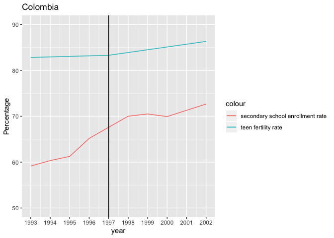

Analysis of Secondary School Enrollment Rate and Teen Fertility Rate: Econometrics
================
Charlie Zheng
4/20/2020

Executive Summary
=================

Does improving a country’s secondary school enrollment rate lower its teen fertility rate? To answer the question, this econometric study is conducted by using OLS regression and difference-in-difference estimate. The study discovered that the increase of secondary school enrollment rate causes the decrease of teen fertility rate.

Data
====

``` r
wdi <- read.csv("wdi.csv")
df <- na.omit(wdi %>% select(countryname,year,sp_ado_tfrt,se_sec_nenr))
df <- rename(df,fertility=sp_ado_tfrt,enrollment=se_sec_nenr)
countries <- unique(df$countryname)
for (i in countries){
  dfsubset <- df %>% filter(countryname==i)
  #remove countries with fewer than 5 entries
  if (nrow(dfsubset)<5){
    countries = countries[countries!=i]
  }
}
df <- subset(df,countryname %in% countries)
```

OLS regression data
-------------------

In order to study the correlation between secondary school enrollment rate and teen fertility rate, the data were retrieved from the World Bank’s World Development Indicators (WDI). Entries with missing data and countries with 5 or fewer entries were removed. After the data cleaning, there are 185 countries left in the dataset. The variables are "secondary school enrollment rate (% net)", represent the percentage of secondary-school-age teenagers who participated the secondary schools in their country; and "teen fertility rate (births per 1,000 women ages 15-19)". From this dataset, I will randomly choose 40 countries, exclude the regions, and remain only the countries. There are 31 countries left in this randomly chosen sample.

``` r
set.seed(65)
sample.countries<- sample(countries,40)
#excluding regions, only include countries
sample.countries = sample.countries[-c(5,6,14,17,22,23,32,33,38)]
df2 <- subset(df,countryname %in% sample.countries)
```

Here is the descriptive statistics about these countries:

``` r
description <- data.frame(country=character(),start_year=integer(),end_year=integer(),average_secondary_school_enrollment=double(),average_teen_fertility_rate=double())
for (i in sample.countries){
  descrdf <- df2 %>% filter(countryname==i)
  descr <- data.frame(country=i,start_year=min(descrdf$year),end_year=max(descrdf$year),average_secondary_school_enrollment=mean(descrdf$enrollment),average_teen_fertility_rate=mean(descrdf$fertility))
  description <- rbind(description,descr)
}
description
```

    ##                  country start_year end_year
    ## 1                 Brazil       2007     2013
    ## 2              Nicaragua       1971     2010
    ## 3               Colombia       2005     2014
    ## 4    Antigua and Barbuda       2000     2014
    ## 5           Burkina Faso       1983     2013
    ## 6                Lebanon       2006     2012
    ## 7               Portugal       1973     2014
    ## 8  Sao Tome and Principe       1988     2011
    ## 9              Swaziland       1970     2013
    ## 10                 Samoa       1995     2014
    ## 11                 Ghana       1999     2015
    ## 12               Belarus       2010     2014
    ## 13        United Kingdom       1971     2014
    ## 14                  Cuba       1972     2013
    ## 15               Bolivia       2001     2013
    ## 16              Cambodia       1998     2008
    ## 17                Latvia       1994     2014
    ## 18              Malaysia       1970     2014
    ## 19      Macao SAR, China       1990     2014
    ## 20               Burundi       1976     2014
    ## 21             Argentina       1974     2013
    ## 22               Lao PDR       1992     2014
    ## 23               Grenada       1972     2014
    ## 24    Iran, Islamic Rep.       2009     2014
    ## 25                Poland       1999     2013
    ## 26                 Japan       1978     2013
    ## 27              Bulgaria       1996     2014
    ## 28                Angola       1972     2010
    ## 29           Afghanistan       1974     2014
    ## 30            Cabo Verde       1987     2014
    ## 31               Myanmar       1999     2014
    ##    average_secondary_school_enrollment average_teen_fertility_rate
    ## 1                            78.070459                   69.208520
    ## 2                            30.096843                  134.782067
    ## 3                            75.351264                   61.131560
    ## 4                            82.360324                   52.968600
    ## 5                            10.739043                  135.300060
    ## 6                            68.938279                   13.153114
    ## 7                            65.482198                   23.652247
    ## 8                            32.995250                   96.646444
    ## 9                            26.691730                  112.456127
    ## 10                           71.040775                   34.742380
    ## 11                           42.582463                   73.770629
    ## 12                           96.382066                   20.723440
    ## 13                           86.328528                   28.880275
    ## 14                           72.072438                   70.170933
    ## 15                           72.991392                   80.168418
    ## 16                           24.577289                   48.477960
    ## 17                           87.454518                   18.240200
    ## 18                           62.408566                   18.939070
    ## 19                           74.227745                    4.221700
    ## 20                            8.455610                   42.302262
    ## 21                           76.343168                   65.304644
    ## 22                           31.730650                   78.158010
    ## 23                           71.688490                   52.409200
    ## 24                           80.111640                   28.727100
    ## 25                           90.724343                   15.683787
    ## 26                           98.500041                    4.873889
    ## 27                           85.871675                   43.216926
    ## 28                            8.625692                  203.226000
    ## 29                           29.932566                  117.535520
    ## 30                           54.954892                   87.452523
    ## 31                           39.970080                   21.764154

Difference in Difference Data
-----------------------------

In 1996, the government of Peru passed education reforms that extended free and compulsory school education to all students aged between 5 and 16 (Clark).This reform significantly improved the secondary school enrollment rate in Peru after 1998. Therefore, I choose to compare the data of Peru and Colombia, another South American country which did not implement such an education reform, from 1993 to 2002. The variables are "secondary school enrollment rate (% gross)", represent the percentage of gross population who participated the secondary schools in their country; and "teen fertility rate (births per 1,000 women ages 15-19)".

``` r
Peru <- wdi %>% filter(countryname=="Peru",year>1992,year<2003) %>% select(year,sp_ado_tfrt,se_sec_enrr)
Peru <- rename(Peru,fertility=sp_ado_tfrt,enrollment.gross=se_sec_enrr)
Colombia <- wdi %>% filter(countryname=="Colombia",year>1992,year<2003) %>% select(year,sp_ado_tfrt,se_sec_enrr)
Colombia <- rename(Colombia,fertility=sp_ado_tfrt,enrollment.gross=se_sec_enrr)
```

There are no missing data in Peru's dataset. The only missing data are found in Colombia's secondary school enrollment rate. Because there are no significant change in Columbia's secondary school enrollment rate, I imputed the missing data with the mean of last year's data and next year's data.

``` r
for (i in 1:length(Colombia$enrollment.gross)){
  if (is.na(Colombia$enrollment.gross[i])){
    Colombia$enrollment.gross[i]<-(Colombia$enrollment.gross[i-1]+Colombia$enrollment.gross[i+1])/2
  }
}
```

Here are the illustrations of the data:

``` r
p1 <- ggplot(Peru,aes(x=year))+
  geom_line(aes(y=fertility,color="teen fertility rate"))+
  geom_line(aes(y=enrollment.gross,color="secondary school enrollment rate"))+
  ggtitle("Peru")+
  xlab("Year")+
  ylab("Percentage")+
  ylim(50,90)+
  scale_x_continuous("year", labels = as.character(Peru$year), breaks = Peru$year)+
  geom_vline(xintercept = 1997)
dfperu <- data.frame(country="Peru",start_year=min(Peru$year),end_year=max(Peru$year),average_secondary_school_enrollment=mean(Peru$enrollment.gross),average_teen_fertility_rate=mean(Peru$fertility))
p2 <- ggplot(Colombia,aes(x=year))+
  geom_line(aes(y=Colombia$fertility,color="teen fertility rate"))+
  geom_line(aes(y=Colombia$enrollment.gross,color="secondary school enrollment rate"))+
  ggtitle("Colombia")+
  xlab("Year")+
  ylab("Percentage")+
  ylim(50,90)+
  xlim(1993,2002)+
  scale_x_continuous("year", labels = as.character(Colombia$year), breaks = Colombia$year)+
  geom_vline(xintercept = 1997)
```

    ## Scale for 'x' is already present. Adding another scale for 'x', which
    ## will replace the existing scale.

``` r
dfcolombia <- data.frame(country="Colombia",start_year=min(Colombia$year),end_year=max(Colombia$year),average_secondary_school_enrollment=mean(Colombia$enrollment.gross),average_teen_fertility_rate=mean(Colombia$fertility))
p1
```


``` r
p2
```



``` r
rbind(dfperu,dfcolombia)
```

    ##    country start_year end_year average_secondary_school_enrollment
    ## 1     Peru       1993     2002                            77.20592
    ## 2 Colombia       1993     2002                            66.79231
    ##   average_teen_fertility_rate
    ## 1                     67.7003
    ## 2                     84.0806

From the graphs, we can clearly see that before 1997, both Peru and Colombia have no significant fluctuation in secondary school enrollment rate and teen fertility rate. After 1998, Peru's secondary school enrollment rate drastically increased and its teen fertility rate also decreased significantly. Whereas in Colombia, the secondary school enrollment rate do not have a significant change before or after 1995, and the teen fertility rate decreases year-by-year moderately.

Method
======

Method 1: OLS Regression
------------------------

The first method is OLS regression for each country throughout each year. The formula is: fertility\_hat = ß0 + ß1enrollment By randomly selecting these countries, I mitigated some omitted variable bias, such as difference of countries between economics, sexual culture, education; because these countries are located all over the 6 continents, consists of countries with most stages of economic and education development. However, there is still omitted variable bias, such as whether the secondary school in this country offer sex education. Because the original dataset does not measure this variable, this omitted variable bias cannot be eliminated. There is also another omitted variable bias, the time gap between each measurements. Because there are too much missing data, each country's data is from significantly different time period. This omitted variable bias cannot be eliminated either.

``` r
#countries whose enrollment is statistically significant
olsresult <- data.frame(country=character(),intercept=double(),coef_enrollment=double(),p_value_enrollment=double())
#OLS regression for each country
for (i in sample.countries){
  reg1 <- lm(fertility~enrollment,df2 %>% filter(countryname==i))
  ttest1 <- coeftest(reg1, vcov=vcovHC(reg1, type = "HC1"))
  if (ttest1["enrollment","Estimate"]<0 & ttest1["enrollment","Pr(>|t|)"]<0.05){
    olsresult <- rbind(olsresult,data.frame(country=i,intercept=ttest1["(Intercept)","Estimate"],coef_enrollment=ttest1["enrollment","Estimate"],p_value_enrollment=ttest1["enrollment","Pr(>|t|)"]))
  }
}
```

Method 2:Difference in Difference
---------------------------------

The treatment "group" is Argentina. The control "group" is Ecuador. The formula is: fertility\_hat = 0 + ß1Argentina\_enrollment + ß2After + ß3Argentina\_enrollment\*After

Although this comparison eliminites the omitted variable bias such as difference in culture, economics and education policy; this data set still suffers from the omitted variable bias that these two countries have different secondary school enrollment rate and teen fertility rate at the first place. There is also a threat to the external validity, because the evidence found in Peru may not be able to be applied to other countries in the world.

Results
=======

Result of OLS regression
------------------------

``` r
olsresult
```

    ##                  country intercept coef_enrollment p_value_enrollment
    ## 1                 Brazil  95.22160     -0.33319998       1.083821e-03
    ## 2              Nicaragua 188.17574     -1.77406238       8.327197e-11
    ## 3               Colombia 137.53101     -1.01391061       4.466536e-05
    ## 4           Burkina Faso 159.95346     -2.29567947       1.805537e-16
    ## 5                Lebanon  19.97232     -0.09891757       2.576087e-02
    ## 6               Portugal  45.77557     -0.33785246       6.934623e-08
    ## 7  Sao Tome and Principe 116.02514     -0.58731769       2.641541e-02
    ## 8              Swaziland 193.53959     -3.03777486       2.630048e-09
    ## 9                  Samoa  61.77512     -0.38052424       3.516566e-02
    ## 10                 Ghana  98.77823     -0.58727461       1.220721e-06
    ## 11               Belarus  66.50266     -0.47497651       1.111921e-02
    ## 12        United Kingdom  71.71547     -0.49618821       8.277607e-06
    ## 13                  Cuba 168.89714     -1.36981919       4.674622e-24
    ## 14               Bolivia 186.75786     -1.46030150       2.353980e-02
    ## 15              Cambodia  51.77444     -0.13412692       7.987789e-04
    ## 16              Malaysia  90.45142     -1.14587390       3.714588e-18
    ## 17      Macao SAR, China  11.91991     -0.10371072       8.074978e-08
    ## 18               Burundi  51.95990     -1.14215726       3.658933e-08
    ## 19             Argentina  88.37273     -0.30216312       1.844482e-07
    ## 20               Lao PDR 112.56644     -1.08439098       1.571686e-08
    ## 21               Grenada 133.10079     -1.12558637       3.613241e-05
    ## 22              Bulgaria 165.14832     -1.41992568       8.800732e-03
    ## 23                Angola 269.28477     -7.65837340       4.689551e-03
    ## 24           Afghanistan 176.79097     -1.97963163       1.217755e-02
    ## 25            Cabo Verde 120.28281     -0.59740422       1.497068e-05
    ## 26               Myanmar  40.93080     -0.47952477       1.118741e-06

After running the OLS regression for every countries in the sample. There are 26 countries' enrollment coefficients negative and statistically significant at 90% confidence level. There are statistically siginificant evidence showing that the increase of secondary school enrollment rate is associated with the decrease of teen fertility rate. For example, in Brazil, on average, a unit increase of secondary school enrollment rate is associated with 0.33 unit decrease of teen fertility rate. Compared with the sample size of 31, these 26 countries provide abundant evidence of this association, but does not entail the causal impact.

Result of Difference in Difference
----------------------------------

``` r
summary(did)
```

    ## Warning in summary.lm(did): essentially perfect fit: summary may be
    ## unreliable

    ## 
    ## Call:
    ## lm(formula = fertility ~ Peru + After + PeruAfter, data = Colombia)
    ## 
    ## Residuals:
    ##        Min         1Q     Median         3Q        Max 
    ## -3.358e-14 -1.332e-14  3.246e-15  1.078e-14  3.779e-14 
    ## 
    ## Coefficients:
    ##               Estimate Std. Error    t value Pr(>|t|)    
    ## (Intercept) -5.023e+00  5.887e-12 -8.532e+11   <2e-16 ***
    ## Peru        -6.906e+00  4.616e-13 -1.496e+13   <2e-16 ***
    ## After        8.509e+01  5.888e-12  1.445e+13   <2e-16 ***
    ## PeruAfter    6.654e+00  4.616e-13  1.441e+13   <2e-16 ***
    ## ---
    ## Signif. codes:  0 '***' 0.001 '**' 0.01 '*' 0.05 '.' 0.1 ' ' 1
    ## 
    ## Residual standard error: 2.482e-14 on 6 degrees of freedom
    ## Multiple R-squared:      1,  Adjusted R-squared:      1 
    ## F-statistic: 7.765e+27 on 3 and 6 DF,  p-value: < 2.2e-16

PeruAfter is statistically significant at 90% confidence level. On average, the decrease of Peru's teen fertility rate is 6.654 units higher than the change of Colombia's teen fertility rate. therefore, Peru's improvement of its secondary school enrollment rate caused the decrease of its teen fertility rate.
